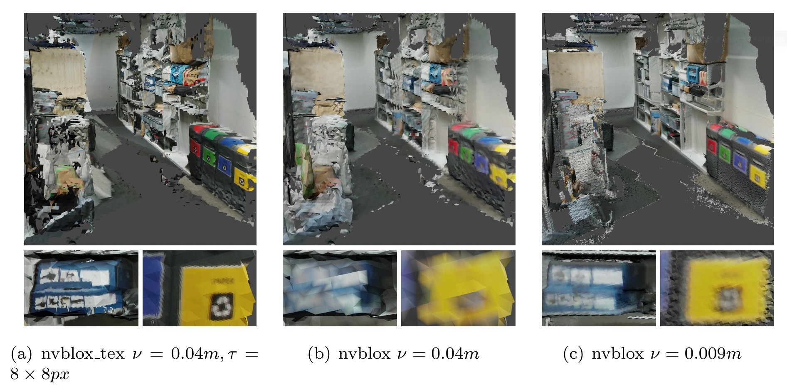
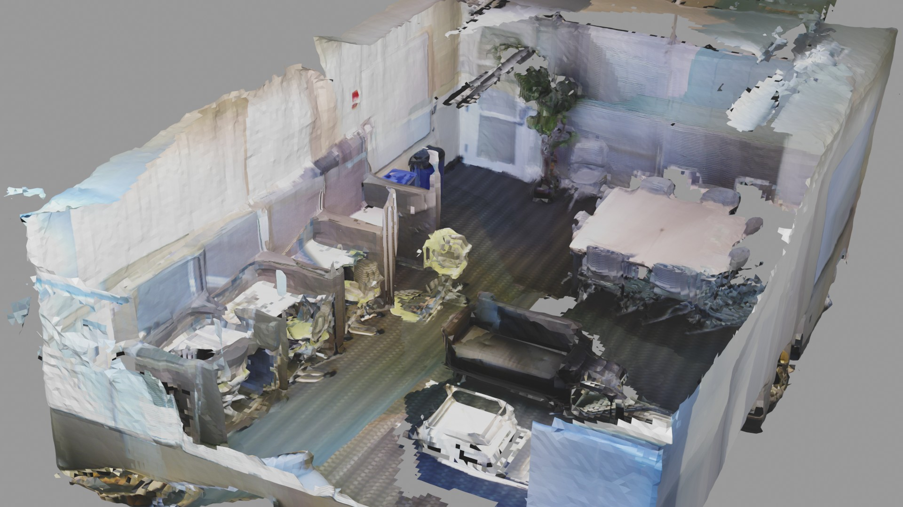

# nvblox_tex
*Texel based mapping on the GPU!*



## Abstract 
Teleoperation can be an important stepping stone to the autonomy of robotic systems. 
However, outsourcing long-term decision-making to a human operator
requires providing them with detailed information on the robot's state in real-time.  
In this project, we, therefore propose using a real-time 3D mapping approach leveraging independent geometry and surface texture resolution 
reconstruction to give the operator a detailed sense of the robot's surroundings while providing real-time performance and optimizing for the size
of the underlying output map representation. To this end, we implement an existing decoupled surface resolution mapping approach, TextureFusion,
on top of a proven scene scale reconstruction framework, voxblox. Using our implementation, nvblox_tex, we are able to reconstruct whole indoor environments in real-time
while improving robustness over TextureFusion as well as visual quality in comparison to voblox.
This enables our implementation to be a building block of future Teleoperation systems on legged robots such as ANYmal. 

# Native Installation
If you want to build natively, please follow these instructions. 
<!-- Instructions for docker are [further below](#docker). -->

## Install dependencies
We depend on:
- gtest
- glog
- gflags (to run experiments)
- CUDA 10.2 - 11.5 (others might work but are untested)
- Eigen (no need to explicitly install, a recent version is built into the library)
Please run
```
sudo apt-get install -y libgoogle-glog-dev libgtest-dev libgflags-dev python3-dev
cd /usr/src/googletest && sudo cmake . && sudo cmake --build . --target install
```

## Build all executables
In the project root do:

```bash
mkdir build
cd build
cmake --no-warn-unused-cli \
    -DCMAKE_EXPORT_COMPILE_COMMANDS:BOOL=TRUE \
    -DCMAKE_BUILD_TYPE:STRING=RelWithDebInfo \
    -DCMAKE_C_COMPILER:FILEPATH=/bin/x86_64-linux-gnu-gcc-9 \
    -DCMAKE_CXX_COMPILER:FILEPATH=/bin/x86_64-linux-gnu-g++-9 \
    -S ../nvblox \
    -B . \
    -G Ninja
cmake --build . \
      --config RegWithDebInfo \
      --target tex_integration
```

## Run an example
In this example we fuse data from the [3DMatch dataset](https://3dmatch.cs.princeton.edu/). First let's grab the dataset. Here I'm downloading it to my dataset folder `~/dataset/3dmatch`.
```bash
wget http://vision.princeton.edu/projects/2016/3DMatch/downloads/rgbd-datasets/sun3d-mit_76_studyroom-76-1studyroom2.zip -P ~/datasets/3dmatch
unzip ~/datasets/3dmatch/sun3d-mit_76_studyroom-76-1studyroom2.zip -d ~/datasets/3dmatch
```
Navigate to and run the `tex_integration` binary. From the nvblox_tex base folder run
```bash
cd nvblox/build/experiments
./tex_integration ~/datasets/3dmatch/sun3d-mit_76_studyroom-76-1studyroom2/  --mesh_output_path 3dmatch.ply --texture_output_path 3dmatch.png
```
Once it's done we can view the output mesh using the Open3D viewer (only displays the mesh) or imported to blender / meshlab.
```
pip3 install open3d
python3 ../../visualization/visualize_mesh.py 3dmatch.ply
```
you should see a mesh of a room:




# Developer's Guide
This guide briefly covers the implementation details of nvblox_tex from a developer's perspective. It's aim
is to aid in extending our approach.
Since our approach is an extension of nvblox, which is still fully functional in its original form at 
the time of starting this project, we describe both functionality of nvblox and nvblox_tex in the following paragraphs.

## Executable Binaries
Executable binaries are built from the experiments defined in  `nvblox/experiments/src/fuse_3dmatch.cpp` and `nvblox/experiments/src/tex_integration.cpp` which define the entry-points for reconstruction using nvblox and nvblox_tex respectively.  Specifically, the class `Fuse3DMatch` performs reconstruction using nvblox and `TexFuse3DMatch` performs it using our extension nvblox_tex

Both share many of the same underlying functions in `nvblox/experiments/src/common/fuse_3dmatch.cpp` which performs
the actual function calls for integration. 

The following two functions are of particular interest, since they call the individual Integrators described in the next section. 
```cpp
bool Fuse3DMatch::integrateFrame(const int frame_number);
```

```cpp
bool TexFuse3DMatch::integrateFrame(const int frame_number);
```

Their binaries are build in the `nvblox/build/experiments` directory when using cmake as described in the installation section above.


## nvblox_lib
This is the main shared library with functionality of both nvblox and nvblox_tex. 
For an example of it's usage see the above section on Executable Binaries.

Unless explicitly stated otherwise, all functionality described below is relevent for both nvblox and nvblox_tex. 
## Dataset Loaders
`nvblox/include/nvblox/datasets`

Here, the dataset loaders are defined for loading `.png` color and depth images as well as the pose files in the 3dmatch dataset format.

Individual images are loaded with functions in `nvblox/include/nvblox/datasets/image_loader.h`. The entire dataset is parsed with `nvblox/include/nvblox/datasets/parse_3dmatch.h`. Both nvblox and nvblox_tex use the same functionality from these headers.

Of note is that the image loaders in `parse_3dmatch.h` have both a single- and multi-threaded implementation. We preferr the multi-threaded version for the fastest reconstruction speeds.

## Core
`nvblox/include/nvblox/core`

This folder contains core functionality for both nvblox and nvblox_tex most common types are defined here such as implementations for voxels.


### Voxels 
`nvblox/include/nvblox/core/voxels.h`

This header defines all of the differnet voxel types used throughout nvblox and nvblox_tex. Specifically, we use the following voxel types:

```cpp
struct TsdfVoxel;

struct EsdfVoxel;

struct ColorVoxel;

template <typename _ElementType, int _PatchWidth>
class TexVoxelTemplate;

struct FreespaceVoxel;
```

When adding a new voxel type here, care must be taken that each function on it is callable from CUDA cuda using the `__host__ __device__` annotations. Also, since each of the above structs is individually stored in GPU memory
the number of bytes used by each struct should be as small as possible while taking care to align memory access of the inividual fields.

### Voxel Block
`nvblox/include/nvblox/core/blox.h`

Individual Voxels are grouped by the `VoxelBlock` class into blocks of constant size (currently `8x8x8`) since such a grouping fitts well with the thread block model of the GPU. Conceptually, each block is processed independently and in arbitrary order.

`VoxelBlock` is a template class whose specializations are defined in `common_names.h`.

### Voxel Block Layer
`nvblox/include/nvblox/core/layer.h`

`VoxelBlock`s are collected by a `VoxelBlockLayer` class of a single type. Therefore, each layer manages all allocated voxels of a given type. This class a templated and independent of the conrete type used.
Specializations are defiend in `common_names.h`
### Common Names
`nvblox/include/nvblox/core/common_names.h`

As described in the previous sections this file provides `using` type aliases for the differnt `VoxelBlock` and `VoxelBlockLayer` types used throughout nvblox_lib.

## Integrators
`nvblox/include/nvblox/integrators`

The main functionality of this library is provided by the individual integrators listed below, which take in differnt images of the dataset and integrate them into their own respective representations.

### Projective TSDF Integrator
`nvblox/include/nvblox/integrators/projective_tsdf_integrator.h`

This integrator performs per-frame integration of depth images with associated pose estimates.
The key function for integration of a new depth frame is:

```cpp
void ProjectiveTsdfIntegrator::integrateFrame;
```

It dynamically allocates all required GPU and system memory and performs the integration on the GPU.

This functionality is used by both nvblox and nvblox_tex.

### Projective Color Integrator
`nvblox/include/nvblox/integrators/projective_color_integrator.h`


### Projective Tex Integrator
`nvblox/include/nvblox/integrators/projective_tex_integrator.h`

This integrator contains the majority of the additions of nvblox_tex.
It performs integration of a color frame into the `TexVoxelLayer` by assuming a TSDF integration of the associated depth frame is already available. 

Based on this TSDF surface integration, it integrates a new frame using the following function:

```cpp
void ProjectiveTexIntegrator::integrateFrame;
```

This integration function firstly allocates all required blocks in the camera view if they have not been allocated already. 

**Neighbor Updates** 
```cpp
void ProjectiveTexIntegrator::updateNeighborIndicies;
```
Since different voxel blocks do not natively contain adjacency information 
between themselves, this function updates a 2D adjacency index for each allocated block.

**Normal Directions**
```cpp
void ProjectiveTexIntegrator::updateVoxelNormalDirections;
```
This function performs the normal computation on the TSDF grid and quantizes the compted normals into discrete `TexVoxel` directions which are then stored in each voxel. Computation is done on the GPU.

For more details on how this computation works, see the project report.

**Depth Image rendering**
### ESDF Integrator
`nvblox/include/nvblox/integrators/esdf_integrator.h`


## Unit Tests
`nvblox/tests`

# License
NVIDIA source code is under an [open-source license](LICENSE) (Apache 2.0). :)
